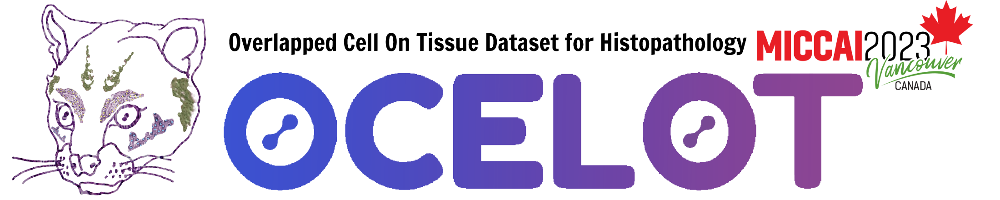

# SoftCTM: Cell detection by soft instance segmentation and consideration of cell-tissue interaction

In this repository, you can find the source code to recreate our [Grand Challenge OCELOT 23](https://ocelot2023.grand-challenge.org/) **algorithm container**.
It provides a pan-cancer (trained on kidney, head-and-neck, prostate, stomach, endometrium, and bladder samples) deep-learning model for detecting tumor and background cells in H&E whole slide images. This makes it directly applicable for tasks such as tumor content estimation.
For more information check out our [paper on the method](https://arxiv.org/abs/2312.12151), as well as [OCELOT Challenge 2023](https://ocelot2023.grand-challenge.org/) and [OCELOT dataset](https://lunit-io.github.io/research/publications/ocelot/).

## Our algorithm
Detecting and classifying cells in histopathology whole-slide images is a core task in computational pathology, as it provides valuable insight into the tumor micro environment. In this work we investigate the impact of ground truth formats on the models performance. Additionally, cell-tissue interactions are considered by providing tissue segmentation predictions as input to the cell detection model. We find that a soft, probability-map instance segmentation ground truth leads to best model performance. Combined with cell-tissue interaction and test-time augmentation we achieve 3rd place on the Overlapped Cell On Tissue (OCELOT) test set with mean F1-Score 0.7172.


## Download pretrained models
Please download our pretrained tissue segmentation and cell detection model [here](https://1drv.ms/f/s!Aqry0_PzRNA6gdEhYsuOSooj7PP-Gg?e=9kQiE2).
Create a folder `onnx` on the top-level of the repository and add the models there.

## Build the docker image

Build our docker image:

```bash
bash build.sh
```

## Testing docker image

The script `test.sh` will create the image, run a container and verify that the output file `cell_classification.json` is generated at the designated directory. To do so, simply run the following command:

```bash
bash test.sh
```

## Export algorithm docker image

Generate the `tar` file containing the algorithm docker image:

```bash
bash export.sh
```

## Run inference

You can run inference using the algorithm docker image with the following command, add your desired input and output paths where indicated:
```bash
docker run --rm \
        --memory="12g" \
        --memory-swap="12g" \
        --network="none" \
        --cap-drop="ALL" \
        --security-opt="no-new-privileges" \
        --shm-size="128m" \
        --pids-limit="256" \
        -v your-input-path:/input \
        -v your-output-path:/output/ \
        ocelot23algo
```

The output of the algorithm is a json file that logs all detected cells for each image in the format:
```
{
    "name": "image_id",
    "point": [
        x,
        y,
        class_label
    ],
    "probability": confidence_score
}
```

# Credits
The source code and description is adapted from Lunits [OcelotAlgo23 repository](https://github.com/lunit-io/ocelot23algo).
```
@InProceedings{Ryu_2023_CVPR,
    author = {Ryu, Jeongun and Puche, Aaron Valero and Shin, JaeWoong and Park, Seonwook and Brattoli, Biagio and Lee, Jinhee and Jung, Wonkyung and Cho, Soo Ick and Paeng, Kyunghyun and Ock, Chan-Young and Yoo, Donggeun and Pereira, S\'ergio},
    title = {OCELOT: Overlapped Cell on Tissue Dataset for Histopathology},
    booktitle = {Proceedings of the IEEE/CVF Conference on Computer Vision and Pattern Recognition (CVPR)},
    month = {June},
    year = {2023},
    pages = {23902-23912}
}
```

# Code Usage
If you find this code helpful to your work and want to use it, please cite:
```
@misc{schoenpflug2023softctm,
      title={SoftCTM: Cell detection by soft instance segmentation and consideration of cell-tissue interaction}, 
      author={Lydia A. Schoenpflug and Viktor H. Koelzer},
      year={2023},
      eprint={2312.12151},
      archivePrefix={arXiv},
      primaryClass={eess.IV}
}
```
